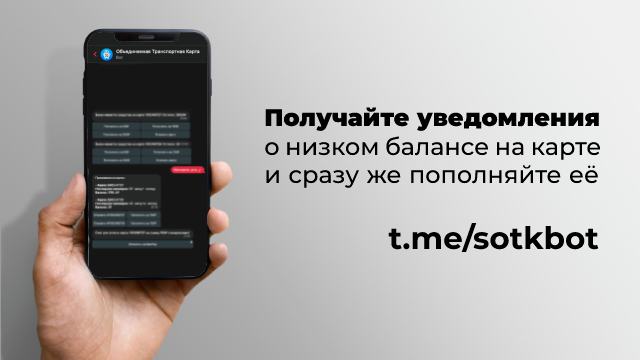

# Бот Telegram для s-otk.ru 

Telegram-бот, предупреждающий о малом остатке на транспортной карте с сайта s-otk.ru

Развернутая версия: [https://t.me/sotkbot](https://t.me/sotkbot\)

Работает на моей же библиотеке [s-otk-js](https://github.com/VityaSchel/s-otk-js)

## Установка

1. Клонируйте репозиторий
2. Установите зависимости командой `npm i`
3. Добавьте токен в файл .env в корне проекта с ключом `TELEGRAM_BOT_API_TOKEN` и `SOTK_USERNAME`, `SOTK_PASSWORD`
4. Запустите базу данных командой `mongod` и создайте коллекцию `s-otk-bot.cards`
5. Запустите бота командой `npm run build && npm start`

## Использование

Бот поддерживает привязку и отвязку карт. Максимальное кол-во прикрепленных карт можно поменять в константе `MAX_LINKED_CARDS` файле src/cardsList.ts

Для отслеживания баланса используется скрипт src/cron/index.ts, который вы можете запускать так часто, как захотите. Он проходится по всем картам в БД и запрашивает баланс. Если баланс слишком маленький, отправляет уведомление пользователю в сообщении. Если на момент отправки пользователь остановил бота, удаляет все его карты из БД.

Для работы src/cron/index.ts использует сессию, созданную при старте бота и сохраненную в файл session.json в корне

## TODO

- Батчить отправку результатов по конкретной карте нескольким пользователям
- Параллелизировать получение балансов карт
  - Создать пул из пользователей s-otk.ru
- Удалять из БД карты, которые несколько раз вызвали ошибку (или хотя бы помечать как невалидные для пропуска в будущем)
- Менять threshold в зависимости от типа карты (стоимость одной поездки этого тарифа карты*4)

## Лицензия

[MIT](./LICENSE.md)
 